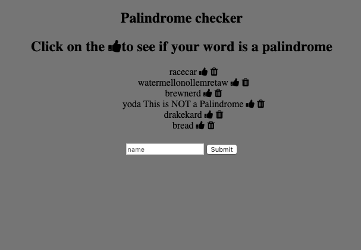

# ✅ Personal Express Palindrome Checker
Have you ever wondered if a word was a palidrome.  Well with this app you can add as many words as you want through your day. Then go back whenever you want to check if they really are.

Tech Used:
- HTML5
- CSS3
- Javascript
- Node.js
- Express
- Mongo DB

## Installation

1. Clone repo
2. run `npm install`

## Usage

1. run `node server.js`
2. Navigate to `localhost:3000`
3. Have fun ;)
